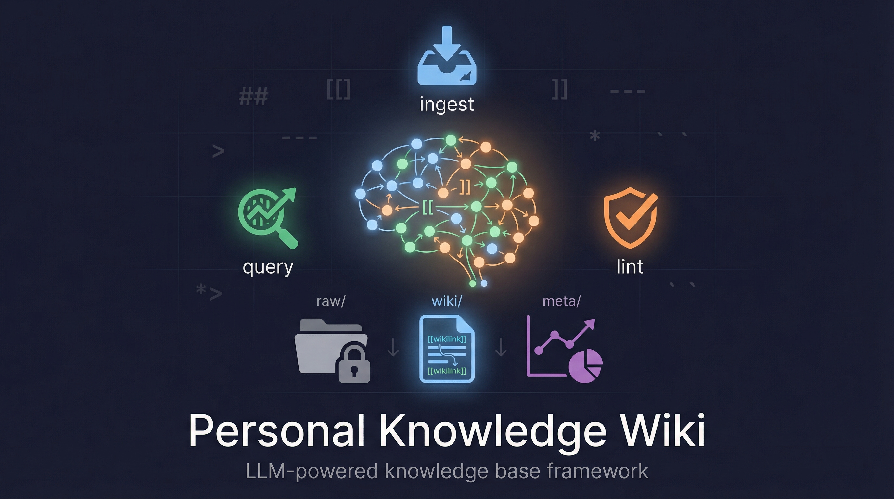

# 个人知识 Wiki



[English README](README.md)

> **LLM 不是聊天机器人，它是你的持久化 wiki 维护者。**

一个开源框架，用于构建 **个人知识库**——你负责投喂原料和提问，**Claude Code** 负责所有维护工作：摘要、交叉引用、归档、质量控制。

一个交互式脚本。五个 Claude Code 技能。零数据库依赖。只有纯 Markdown 文件，随时间复利增长。

灵感来源：[Andrej Karpathy 的 LLM Wiki](https://gist.github.com/karpathy/442a6bf555914893e9891c11519de94f) 模式和 [Obsidian](https://obsidian.md) 的本地优先理念。

---

## 为什么做这个

传统笔记管理的三大问题：

- 写下来 → 忘了在哪 → 再也找不到
- 和 LLM 对话产出洞察 → 关掉窗口就消失了
- 积累几百个文件 → 没有交叉引用，没有质量控制，没有结构

本项目将知识管理视为一个 **编译过程**：

```
                         ┌─────────────────────────────┐
  对话                    │                             │
  论文         ───→       │   LLM 编译器 (Claude)        │   ───→  结构化 Wiki
  笔记                    │                             │         带交叉引用
  文章                    │   ingest │ query │ lint     │         和质量控制
                         └─────────────────────────────┘
```

**Karpathy 的核心洞察**：LLM 不只是回答问题——它**维护一个持久化的 wiki**。每一条知识都被编译进互相连接的页面网络，而不是堆进孤立的文件里。

---

## 工作原理

### 三层架构

```
你的知识库/
├── CLAUDE.md              # 宪法——模式、规则、工作流定义
├── log.md                 # 追加时间线（只增不删）
│
├── raw/                   # 第一层：原始记录（不可变）
│   ├── 科研/              │   人类拥有。写入后不再修改。
│   │   ├── 论文笔记/      │   对话提取、论文笔记、
│   │   ├── 学术写作/      │   文章、书摘、网页剪藏。
│   │   └── 工具/          │
│   ├── 阅读/              │
│   └── assets/            │   图片、PDF、附件
│
├── wiki/                  # 第二层：编译知识（LLM 维护）
│   ├── index.md           │   总目录——LLM 的检索入口
│   ├── entities/          │   实体页：人、工具、期刊、项目
│   ├── concepts/          │   概念页：方法、理论、术语、原则
│   ├── topics/            │   专题页：指南、规范、最佳实践
│   └── syntheses/         │   综合页：查询归档、对比分析
│
└── meta/                  # 第三层：诊断
    └── reports/           │   lint 报告、健康检查
```

**核心规则**：`raw/` 是历史（不可变），`wiki/` 是真相（永远最新），`log.md` 是操作日志（只追加）。

### 五大操作

#### 1. Ingest（摄入）——把知识喂进去

分析对话或文件，将知识 **编译** 进 wiki 网络。一次 ingest 通常触及 **5-15 个页面**——创建/更新实体页、概念页、专题页，并织入 `[[wikilink]]` 交叉引用。

```
你：ingest 这次对话
Claude：
  1. 分析内容 → 识别实体、概念、专题
  2. 存原始记录到 raw/（不可变）
  3. 创建或更新 5-15 个 wiki 页面
  4. 织入 [[wikilink]] 交叉引用
  5. 更新 wiki/index.md 和 log.md
  6. 报告触及了哪些页面
```

**可以 ingest 什么？**

| 输入 | 怎么用 | 例子 |
|------|--------|------|
| 当前对话 | "ingest 这次对话" | 论文润色后提取写作规则 |
| 外部文件 | "把这个文件 ingest 进知识库" | Zotero 里的论文笔记 |
| 批量文件 | "把这个目录下的 md 都 ingest" | 迁移旧笔记 |
| 粘贴内容 | 直接粘贴 + "ingest 一下" | 网页文章、邮件等 |

#### 2. Query（查询）——把知识取出来

基于 **你自己积累的知识** 回答问题（不是 LLM 的通用知识）。每条结论都标注 `[[wikilink]]` 来源。有价值的回答可归档为综合页面。

```
你：查知识库：代码审查有什么最佳实践？
Claude：
  1. 搜索 index + grep wiki/ 找相关页面
  2. 读取并综合你的页面内容
  3. 返回带 [[wikilink]] 引用的回答
  4. 问你："要归档为综合页面吗？"
```

#### 3. Lint（体检）——保持健康

8 条硬编码确定性规则 + 软性 LLM 分析。输出结构化报告到 `meta/reports/`。

| # | 规则 | 检查什么 |
|---|------|---------|
| 1 | 死链检测 | 每个 `[[wikilink]]` 都指向存在的文件 |
| 2 | 孤儿页检测 | 每个页面有 ≥1 个入链 |
| 3 | Frontmatter 完整性 | 7 个必填 YAML 字段齐全 |
| 4 | Tag 一致性 | 所有 tag 在 approved list 内 |
| 5 | 源可追溯性 | 实体/概念页引用 ≥1 个 raw 源 |
| 6 | 索引同步 | `wiki/index.md` 与实际文件一致 |
| 7 | 文件命名 | 符合各类型命名约定 |
| 8 | Stale 检测 | 标记 90+ 天未更新且有新源的页面 |

**为什么要硬编码规则？** 纯靠 LLM 判断不可靠——LLM 会"忘记"检查某些规则。8 条硬编码规则是 **确定性的**，每次都完整执行。软性分析（矛盾检测、薄弱页面、缺失链接）作为补充。

#### 4. Migrate（迁移）——批量导入已有笔记

专为首次搭建或从其他笔记系统（Notion、Obsidian、Roam、纯 Markdown）迁移设计。扫描目录、自动分类、批量创建 raw 记录和 wiki 页面。

```
你：把 ~/old-notes/ 下的笔记迁移进来
Claude：
  1. 扫描目录 → 发现 23 个 Markdown 文件
  2. 展示分类计划等你确认
  3. 批量创建 raw 记录 + wiki 页面
  4. 报告：23 个文件 → 18 个新 wiki 页面 + 4 个更新
  5. 建议：运行 lint，这 3 个页面需要补充细节
```

#### 5. Export（导出）——发布为静态网站

将 `wiki/` 导出为可浏览的静态网站。支持 MkDocs Material（搜索+暗色模式）、Quartz（类 Obsidian 图谱视图）、或纯 HTML。

```
你：导出知识库为网站
Claude：
  1. 询问格式偏好（MkDocs / Quartz / 纯 HTML）
  2. 将 [[wikilinks]] → 标准链接
  3. 生成导航和搜索索引
  4. 输出到 site/ 目录
  5. 展示部署选项（GitHub Pages、Netlify、Vercel）
```

### 四类 Wiki 页面

| 类型 | 存什么 | 文件位置 | 例子 |
|------|--------|---------|------|
| **Entity（实体）** | 具名事物：人、工具、期刊、项目 | `wiki/entities/` | `React.md`, `Zotero.md` |
| **Concept（概念）** | 方法、理论、原则、模式 | `wiki/concepts/` | `DRY.md`, `MARL.md` |
| **Topic（专题）** | 指南、规范、最佳实践 | `wiki/topics/` | `Git工作流.md`, `代码审查指南.md` |
| **Synthesis（综合）** | 查询归档、对比分析 | `wiki/syntheses/` | `2026-04-10-X与Y对比.md` |

每个页面包含：
- **YAML frontmatter**：type, domain, created, updated, sources, tags, aliases
- **结构化章节**：Overview/Definition → Details → Common Pitfalls → Related
- **`[[wikilink]]` 交叉引用**：双向链接，每页首次提到时链接

---

## 快速开始

### 前置条件

| 工具 | 必需？ | 用途 |
|------|--------|------|
| [Claude Code](https://claude.ai/code) | **必需** | 执行所有操作的 LLM 引擎 |
| [Obsidian](https://obsidian.md) | 推荐 | 浏览 wiki 的 IDE（图谱视图、wikilink 导航） |
| [Git](https://git-scm.com) | 推荐 | 版本控制，追踪知识演变 |
| bash / zsh | 必需 | 运行安装脚本 |

### 一键安装

```bash
git clone https://github.com/ZLHad/personal-knowledge-wiki.git
cd personal-knowledge-wiki
bash scripts/setup.sh
```

### 安装脚本做了什么

脚本是 **完全交互式的**，支持 **英文/中文** 界面——一步步引导你构建一切：

```
Language / 语言选择:
  1. English (default)
  2. 中文
Choose [1/2]: 2

━━━━━━━━━━━━━━━━━━━━━━━━━━━━━━━━━━━━━━━━━━━━━━━━━━━━━━━━━━━━
  步骤 1/5：Wiki 位置
━━━━━━━━━━━━━━━━━━━━━━━━━━━━━━━━━━━━━━━━━━━━━━━━━━━━━━━━━━━━

Wiki 创建位置：~/Documents/我的知识库

━━━━━━━━━━━━━━━━━━━━━━━━━━━━━━━━━━━━━━━━━━━━━━━━━━━━━━━━━━━━
  步骤 2/5：配置知识领域
━━━━━━━━━━━━━━━━━━━━━━━━━━━━━━━━━━━━━━━━━━━━━━━━━━━━━━━━━━━━

领域 1: 科研
  子分类: 论文笔记, 学术写作, 工具
领域 2: 阅读
  子分类: 书籍, 文章
领域 3:（留空结束）

━━━━━━━━━━━━━━━━━━━━━━━━━━━━━━━━━━━━━━━━━━━━━━━━━━━━━━━━━━━━
  步骤 3/5：创建 Wiki 目录结构
━━━━━━━━━━━━━━━━━━━━━━━━━━━━━━━━━━━━━━━━━━━━━━━━━━━━━━━━━━━━

[✓] raw/         （不可变原始记录）
[✓] wiki/        （LLM 维护的编译知识）
[✓] meta/        （lint 报告、诊断）
[✓] CLAUDE.md    （wiki 宪法）

━━━━━━━━━━━━━━━━━━━━━━━━━━━━━━━━━━━━━━━━━━━━━━━━━━━━━━━━━━━━
  步骤 4/5：安装 Claude Code 技能
━━━━━━━━━━━━━━━━━━━━━━━━━━━━━━━━━━━━━━━━━━━━━━━━━━━━━━━━━━━━

[✓] wiki-ingest  → ~/.claude/skills/wiki-ingest
[✓] wiki-lint    → ~/.claude/skills/wiki-lint
[✓] wiki-query   → ~/.claude/skills/wiki-query
[✓] wiki-migrate → ~/.claude/skills/wiki-migrate
[✓] wiki-export  → ~/.claude/skills/wiki-export

━━━━━━━━━━━━━━━━━━━━━━━━━━━━━━━━━━━━━━━━━━━━━━━━━━━━━━━━━━━━
  步骤 5/5：Obsidian 配置
━━━━━━━━━━━━━━━━━━━━━━━━━━━━━━━━━━━━━━━━━━━━━━━━━━━━━━━━━━━━

[✓] Minimal 主题已安装
[✓] 7 个插件已下载并注册
[✓] Templater 模板已安装（4 种页面类型）
[✓] Dataview 仪表盘
[✓] Claude Code 项目配置
```

### 安装后

```bash
# 1. 在 Obsidian 中打开知识库目录作为 vault
# 2. 启用社区插件：Settings → Community plugins → 关掉 Safe Mode → 全部启用

# 3. 启动 Claude Code（在任意目录下！）
claude

# 4. 进行一次有价值的对话后：
> ingest 这次对话

# 5. 查询积累的知识：
> 查知识库：关于 X 有什么？

# 6. 运行健康检查：
> lint wiki
```

### 手动安装（不用脚本）

如果你更喜欢自己动手：

1. 复制 `templates/CLAUDE.md` 到知识库目录，替换 `{{占位符}}`
2. 创建目录结构：`raw/`、`wiki/{entities,concepts,topics,syntheses}`、`meta/reports/`
3. 复制 `templates/index.md` → `wiki/index.md`，`templates/log.md` → `log.md`
4. 复制 `skills/` 内容到 `~/.claude/skills/`，替换每个 SKILL.md 中的 `{{WIKI_PATH}}`
5. （可选）手动配置 Obsidian vault

---

## 使用指南

### 日常工作流

#### 场景 1：有价值的对话后

```
你：（和 Claude 完成一轮论文润色后）
你：ingest 这次对话

Claude：分析对话...
  - 类型：学术写作
  - 实体：IEEE-TVT, LaTeX
  - 概念：符号一致性, 过渡钩子
  - 专题：摘要写作规范

  确认？(y)

Claude：Ingest 完成！
  原始记录：raw/科研/学术写作/2026-04-07-abstract-revision.md
  触及页面：8 个（2 新建 + 6 更新）
  新建：[[符号一致性]], [[过渡钩子]]
  更新：[[IEEE-TVT]], [[摘要写作规范]], ...
```

#### 场景 2：工作前查询

```
你：查知识库：Related Work 怎么写？

Claude：根据你的 wiki：
  从 [[Related-Work写作规范]]：
  - 每段一个 stream，用 [[过渡钩子]] 连接...
  - 避免 [[AI味道词汇]]...
  从 [[段落缝合]]：
  - 上一段末句和下一段首句要呼应...

  要归档为综合页面吗？(y/n)
```

#### 场景 3：定期维护

```
你：wiki 体检

Claude：Wiki Lint Report - 2026-04-07
  | 检查项         | 状态 | 问题数 |
  |---------------|------|--------|
  | 1. 死链       | PASS | 0      |
  | 2. 孤儿页     | FAIL | 2      |
  | 3. Frontmatter| PASS | 0      |
  ...
  总体：7/8 通过，1 个警告

  自动修复孤儿页？(y/n)
```

### Skill 在任意位置可用

五个 skill 安装在 `~/.claude/skills/`，wiki 路径已硬编码。可以在 **任何项目目录** 下触发：

```bash
# 在论文项目里工作
cd ~/Documents/Papers/my-paper
claude
> ingest 这次对话    # → 自动存到你的知识库

# 在代码项目里工作
cd ~/Documents/Code/my-project
claude
> 查知识库：MARL 是什么？   # → 从你的知识库检索
```

### 触发词

| 操作 | 触发词 |
|------|--------|
| **Ingest** | "ingest 这次对话"、"摄入知识"、"提取到 wiki"、"更新知识库"、"记录到知识库" |
| **Query** | "查知识库"、"wiki 搜索"、"知识库里关于 X"、"从知识库找" |
| **Lint** | "lint wiki"、"wiki 体检"、"检查知识库"、"知识库健康检查" |
| **Migrate** | "迁移笔记"、"批量导入"、"从 Notion 迁移" |
| **Export** | "导出知识库"、"发布 wiki"、"生成静态网站" |

### 新增领域分类

随着兴趣扩展，随时可以添加新领域：

```
你：在知识库加一个"编程"分类

Claude：（自动修改三处）
  1. CLAUDE.md — 在 raw/ 架构树中加 编程/，加 "编程" tag
  2. wiki-ingest SKILL.md — 加域分类路由
  3. 创建 raw/编程/ 目录
```

---

## Obsidian 集成

安装脚本将 [Obsidian](https://obsidian.md) 配置为知识库的可视化 "IDE"。

### 预装主题和插件

| 组件 | 用途 | 为什么选它 |
|------|------|-----------|
| **Minimal**（主题） | 干净的 wiki 风格排版 | Obsidian CEO kepano 亲做，Dataview 表格最美 |
| **Dataview** | 基于 YAML frontmatter 的动态查询表格 | 按域、tag、更新时间筛选页面 |
| **Templater** | 模板引擎 | 一键创建带正确 frontmatter 的新页面 |
| **Obsidian Git** | git 自动备份 | 完整历史、回滚、多设备同步 |
| **Tag Wrangler** | 批量重命名/合并标签 | frontmatter 密集型 vault 必备 |
| **Style Settings** | 主题定制面板 | 不写 CSS 就能调颜色、字体、布局 |
| **Iconize** | 文件/文件夹图标 | 侧边栏分类一目了然 |
| **Excalidraw** | 嵌入式白板/绘图 | 概念图、架构图、知识地图 |

### 浏览操作

| 操作 | 方式 |
|------|------|
| 跳转到页面 | `Cmd+O` → 输入页面名 |
| 跟随链接 | `Cmd+Click` 点击 `[[link]]` |
| 图谱视图 | `Cmd+G` 或侧边栏图标 |
| 全局搜索 | `Cmd+Shift+F` |

### Dataview 查询示例

在任意页面添加动态表格：

````markdown
```dataview
TABLE domain, updated, tags
FROM "wiki/concepts"
SORT updated DESC
```
````

---

## 设计决策

### 为什么用纯文本 Markdown？

- 人和 LLM 都能直接读写
- `git diff` 清晰展示知识演变
- Obsidian 开箱兼容
- 零依赖——不需要数据库、向量存储、服务器

### 为什么覆写而不是追加？

Wiki 页面代表 **编译真相**——最新的认知。新知识与旧内容矛盾时，旧内容被替换。历史保存在 `raw/`（不可变源记录）和 `log.md`（操作时间线），不在 wiki 页面里。

### 为什么一次 ingest 要触及 5-15 个页面？

旧模式是"一次对话 → 一个独立文件"，知识是孤立的。要求每次 ingest 更新整个 wiki 网络——实体、概念、专题、交叉引用——确保知识是 **编织** 的，不是存档的。价值随交叉引用的增多而复利增长。

### 为什么用 Obsidian 做 IDE？

磁盘上的纯文本文件，丰富的插件生态，与其他工具高度可组合。正如 Obsidian 团队所说：**Obsidian 是浏览器，LLM 是引擎**。

---

## 项目结构

```
personal-knowledge-wiki/
├── README.md                  # 英文文档
├── README_CN.md               # 中文文档（本文件）
├── LICENSE                    # MIT 许可证
├── cover.jpg                  # 项目封面图
│
├── scripts/
│   └── setup.sh               # 交互式一键安装（英文/中文）
│
├── skills/                    # Claude Code Skills（→ ~/.claude/skills/）
│   ├── wiki-ingest/           # 知识摄入
│   │   ├── SKILL.md
│   │   └── references/        # 提取策略指南
│   │       ├── academic-writing-guide.md
│   │       ├── technical-task-guide.md
│   │       └── reading-notes-guide.md
│   ├── wiki-lint/             # 8 硬规则 + 软性分析
│   │   └── SKILL.md
│   ├── wiki-query/            # 多策略搜索 + 综合
│   │   └── SKILL.md
│   ├── wiki-migrate/          # 批量导入
│   │   └── SKILL.md
│   └── wiki-export/           # 静态网站生成
│       └── SKILL.md
│
├── templates/                 # 带 {{占位符}} 的模板文件
│   ├── CLAUDE.md              # Wiki 宪法模板
│   ├── index.md               # 空白索引模板
│   ├── log.md                 # 初始时间线模板
│   ├── settings.json          # Claude Code 项目配置
│   └── obsidian/              # Obsidian 模板
│       ├── entity-template.md     # Templater：实体页
│       ├── concept-template.md    # Templater：概念页
│       ├── topic-template.md      # Templater：专题页
│       ├── synthesis-template.md  # Templater：综合页
│       └── dashboard.md          # Dataview 仪表盘（8 个查询）
│
└── examples/                  # 示例 wiki 页面
    ├── entity-example.md      # React（实体）
    ├── concept-example.md     # DRY 原则（概念）
    ├── topic-example.md       # 代码审查最佳实践（专题）
    └── synthesis-example.md   # 何时抽象 vs 何时重复（综合）
```

---

## 贡献

这是一个框架，不是产品。Fork 它，定制它，让它成为你自己的。

### 扩展方向

- [ ] 更多提取指南（会议笔记、代码审查、课程笔记）
- [ ] CSS 美化代码片段
- [ ] 更多 lint 规则（循环引用、断图片等）
- [ ] 间隔重复技能（定期回顾页面）
- [ ] 多 vault 支持（工作/个人分开）
- [ ] 自动化定期 lint（cron / git hooks）
- [ ] `meta/` 中的知识图谱统计看板

### 如何贡献

1. Fork 本仓库
2. 创建功能分支（`git checkout -b feature/new-extraction-guide`）
3. 提交你的改动
4. 发起 Pull Request

---

## 常见问题

**Q：支持 GPT / 其他 LLM 吗？**
A：Skills 是为 Claude Code 编写的，但架构（CLAUDE.md 模式、目录结构、页面格式）是 LLM 无关的。你可以为其他 LLM 工具改写 skills。

**Q：可以不用 Obsidian 吗？**
A：可以。Obsidian 是可选的——只是一个方便的浏览器。Wiki 就是纯 Markdown 文件，任何编辑器都能用。会失去图谱视图和 wikilink 导航，但核心系统正常运行。

**Q：知识库能有多大？**
A：没有硬性限制。系统使用纯文本 + YAML frontmatter，可以扩展到数千页。Obsidian 处理大型 vault 很流畅。LLM 通过 index.md 按需读取页面，不需要加载全部内容。

**Q：数据安全吗？**
A：一切都在你的本地机器上。没有数据被发送到任何地方（除了活跃对话时发送到 Claude API——和正常使用 Claude Code 一样）。Wiki 文件就是磁盘上的 Markdown。

**Q：能跨设备同步吗？**
A：把知识库推到 GitHub 私有仓库即可。安装脚本可以帮你初始化 git。Obsidian Git 插件处理自动 commit/push。

---

## 致谢

- [Andrej Karpathy](https://gist.github.com/karpathy/442a6bf555914893e9891c11519de94f) — LLM Wiki 模式和核心洞察
- [Obsidian](https://obsidian.md) — 本地优先的知识 IDE
- [Claude Code](https://claude.ai/code) — 驱动所有操作的 LLM 引擎

---

## 联系方式

- **作者**：ZLHad
- **邮箱**：zhangczssx@gmail.com
- **Issues**：[GitHub Issues](https://github.com/ZLHad/personal-knowledge-wiki/issues)

## 许可证

[MIT](LICENSE) — 随意使用。欢迎注明出处但不强制。
